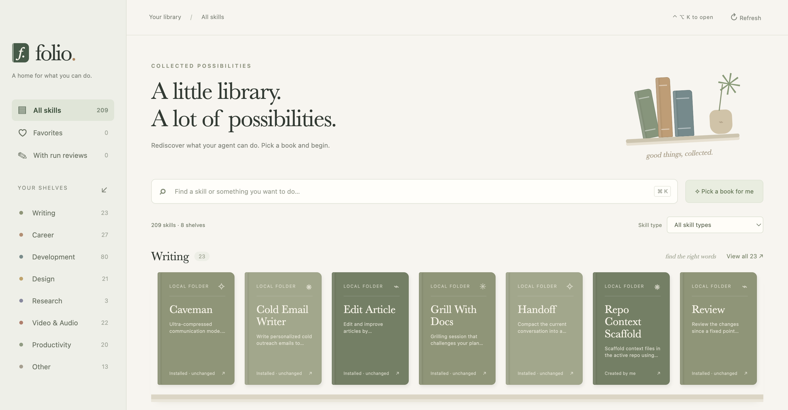
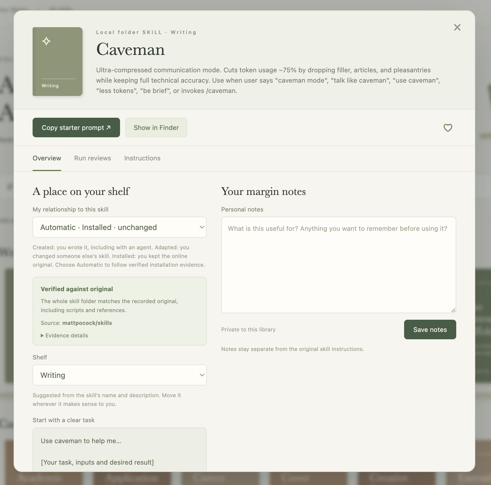

  

<h1 align="center">Folio</h1>

A cozy macOS bookshelf to rediscover your agent skills and keep what you learn beside them.

*Rediscover installed skills on shelves, with search and filters to find what you need.*

## Download and open

Download [Folio for Apple Silicon Macs](https://github.com/allisonllx/folio/releases/latest/download/Folio-macOS-arm64.zip) from [GitHub Releases](https://github.com/allisonllx/folio/releases/latest). Unzip it, move `Folio.app` to Applications, and open it. No Node.js or terminal is needed to use the downloaded app.

This preview build is not signed or notarized; macOS may block it on first launch. Intel Macs and Windows are not supported by this download. Keep Folio in the Dock if useful.

- **Control + Option + K:** show/hide Folio while it is running.
- **Command + K:** focus search inside Folio.
- **Menu-bar book icon:** open the library.
- Closing the window keeps the app running. **Folio → Quit** stops it.
- Launch at login is not changed automatically.

## Use

1. Browse a shelf or search names, descriptions, shelves and saved notes.
2. Open a book to read its description and instructions. The Instructions tab offers Rendered Markdown and Raw source views; links copy their address and images appear as references.
3. Copy a starter prompt, paste it in Codex or another agent on this Mac, and replace the task placeholder.
4. Bookmark the skill or change its shelf. Save personal notes separately from the original skill.
5. After useful work, add a manual run review: intention, iterations, lesson and output/session reference.

## A closer look

*Open a book to check its origin, organize it, and keep notes. Run reviews and instructions are one tab away.*

The screenshots show an example local library; skills are not bundled with Folio.

## Local data and sources

Reads `~/.agents/skills`, `~/.codex/skills`, `~/.codex/plugins/cache` and `~/.claude/skills`. It neither executes nor edits skill instructions. Copies collapse into one book only when their entire folder fingerprint and provenance evidence match. Different scripts, references, versions or origins remain separate.

The plugin cache can include inactive versions. Folio does not verify agent activation. “Local folder” identifies a folder location, not authorship. In a book’s Overview, choose Automatic or explicitly set Created by me (including agent-assisted creation), Adapted by me, Installed · unchanged, or Unclassified. Explicit labels take precedence over evidence; choose Automatic again to resume detection. Use the Skill type filter above the shelves with search, favorites, or a shelf.

## Automatic classification

On startup, Refresh, and returning to the window after at least ten seconds, Folio rechecks local evidence:

- **Skills CLI v3:** reads `~/.agents/.skill-lock.json` (or `$XDG_STATE_HOME/skills/.skill-lock.json`). For a corresponding direct child of a known global skill root, compares the full Git tree hash to `skillFolderHash`. Names alone outside those roots never establish installation.
- **Bundled Codex plugins:** reads the plugin and local-marketplace sections of `~/.codex/config.toml`, local `.agents/plugins/marketplace.json` manifests and `.codex-plugin/plugin.json`. Compares the cached skill to the local bundled original only when the plugin name and version agree.
- **Matches:** automatically show Installed · unchanged. The Overview shows the source, version when available, record path and both folder fingerprints.
- **Mismatches:** show Review changes and default to Unclassified; suggest Adapted by me, but never infer that the user authored the changes. A fresh installer hash or matching new bundle version is checked on the next scan.
- **Missing/unsupported evidence:** remains Unclassified. This includes many remote plugin caches, arbitrary copied folders and newly generated skills. Creation through Codex alone does not prove authorship to Folio.
- **Activation:** explicit enabled/disabled entries are shown as local plugin settings. They do not prove that any particular cached version is active in the current agent session. Unknown stays unknown; cached entries remain browsable.

Fingerprints include all file paths, contents, executable modes and symlink definitions, including scripts and references. Git metadata and empty directories are excluded under Git tree semantics; external symlink targets are not followed. Files that change during reading, unsupported file types or folders exceeding 128 MiB/10,000 files cannot be verified. No GitHub requests are made. An installation record or local source is evidence of origin, not a security or quality endorsement.

The Skills CLI hash format is documented in its [upstream implementation](https://github.com/vercel-labs/skills/blob/main/src/skill-lock.ts). Folio never edits installer records or bundled originals. Suggested shelves use keyword rules and are editable. No AI services, runtime network requests or telemetry are used.

User metadata is saved in `~/Library/Application Support/Folio/library.json`. Library details shows the actual path. Back up that file to preserve your notes. IDs currently derive from the canonical source path: moving a skill or upgrading a plugin into a different path may make its old notes inaccessible in the UI; the original metadata remains in the JSON file.

## First-version boundaries

- Reviews are manual; there is no automatic Codex/Cursor session capture.
- The starter prompt is copied, not automatically sent to an agent.
- Output references are stored as text, not uploaded or previewed.
- No skill quality scores, automatic skill edits, portability audit or GitHub publishing yet.
- Custom scan roots, project-scoped installer records, remote-plugin original retrieval, and semantic clustering are future work.
- This is a locally packaged development app, not a signed/notarized public release.

## Develop

Requires Node.js and npm. Clone this repository, run `npm ci`, then `npm start`.

To build the app locally, run `npm run package`, then open `release/Folio-darwin-arm64/Folio.app`. The generated `release/` folder is excluded from Git; downloadable builds are attached to GitHub Releases.

`npm test` runs filesystem fixture tests for scanning, duplicate handling, YAML metadata and durable storage. `npm run test:ui` launches Electron against temporary fixture roots and data to test browsing, escaped source display, favorites, notes, reviews and reload persistence. `npm run package` creates the Apple Silicon macOS app.

The renderer is sandboxed with context isolation. Its narrow preload API provides catalog reads, validated metadata writes, clipboard copying and revealing known skill paths. New windows and navigation are blocked. Imported text is escaped and never interpreted as executable HTML.

## Files

- `main.cjs`, `preload.cjs`: desktop lifecycle, shortcuts, menu bar and IPC.
- `lib/catalog.cjs`: read-only discovery and metadata parsing.
- `lib/fingerprint.cjs`, `lib/provenance.cjs`: full-folder hashes and local installation evidence.
- `renderer/relationships.js`: shared rule for manual overrides versus automatic classification.
- `lib/store.cjs`: validated, serialized, atomic metadata storage.
- `renderer/`: bookshelf and review interface.
- `tests/`: backend fixtures and Electron integration test.
- `docs/`: agreed first-build scope and implementation checklist.
